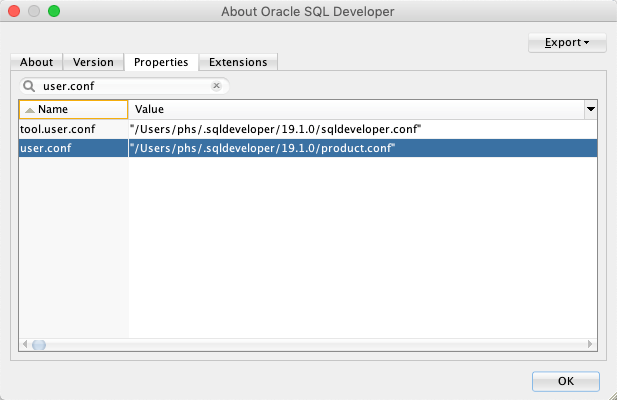
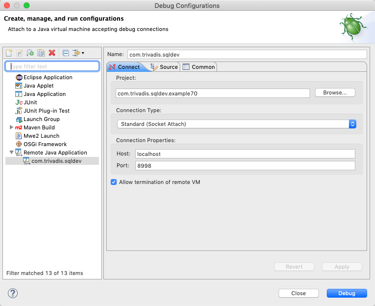

# Remote Debugging in Eclipse

## 1. Enable Debug in `product.conf`

Add the folloing to your `product.conf`:

```
AddVMOption -Xdebug
AddVMoption -Xrunjdwp:transport=dt_socket,address=8998,server=y
```

See `user.conf` property in the `Properties` tab of SQL Developer's `About` dialog for the exact location of your `product.conf` file.



These settings force SQL Developer to wait for the debugger process. These temporariy settings have to be disabled after the debugging session(s).

## 2. Configure Remote Debug 

Add the following debug configuration for your extension project. The port number has to match the one entered in `product.conf`. 



## 3. Start SQL Developer

Start SQL Developer. Remember, SQL Developer will wait for the debugger process. Hence, you will not see a splash screen, since the SQL Developer process is interrupted in an early stage of the startup process.

## 4. Debug

Set a breakpoint in your Java code and start the previously configured Debug Configuration.

The debuger will suspend the process when it reaches a breakpoint.


## 5. Stop SQL Developer

Resume the all suspended threads/processes and stop the SQL Developer gracefully.

## 6. Disable Debug in `product.conf`

Delete or comment out the two previously added `AddVMOption` entries.
