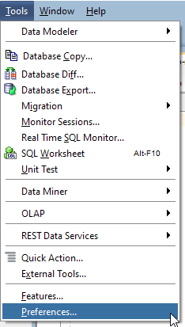
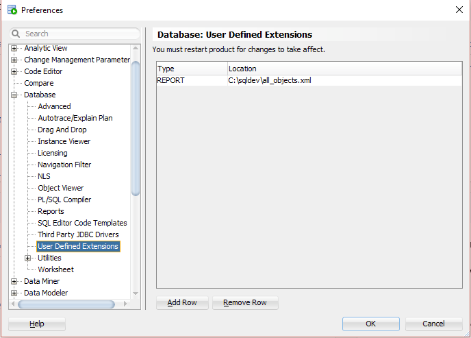
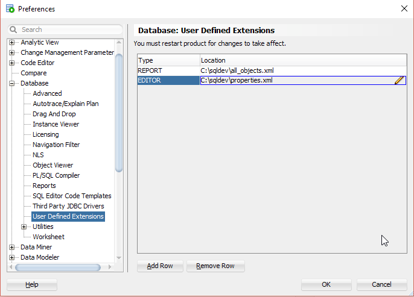
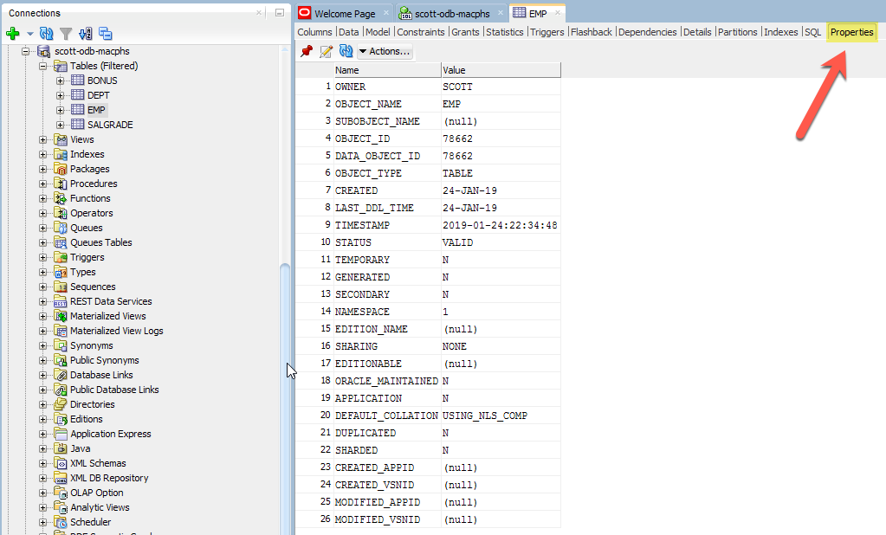
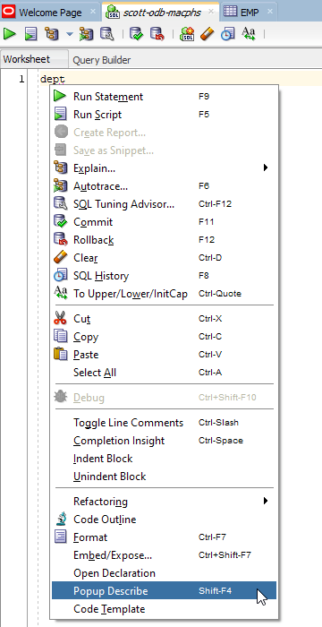
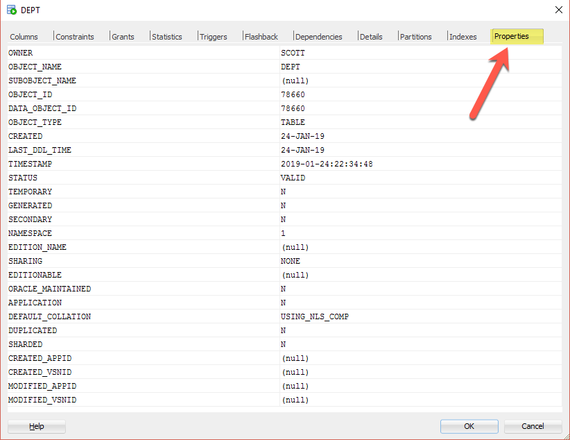

# Create Editor XML Extension

## 1. Start SQL Developer

Start SQL Developer.

## 2. Create XML file

Save the following content to a XML file named `properties.xml`.

```xml
<?xml version="1.0" encoding="UTF-8" ?>
<displays>
	<display type="editor" style="Table" enable="true" 
		objectType="DIRECTORY,FUNCTION,INDEX,JOB,MATERIALIZED VIEW,MATERIALIZED VIEW LOG,OPERATOR,PACKAGE,PACKAGE BODY,PROCEDURE,QUEUE,SYNONYM,RECYCLEBIN,TABLE,TRIGGER,TYPE,TYPE BODY,VIEW">
		<name><![CDATA[Properties]]></name>
		<description><![CDATA[]]></description>
		<tooltip><![CDATA[]]></tooltip>
		<drillclass><![CDATA[]]></drillclass>
		<CustomValues>
			<TYPE><![CDATA[vertical]]></TYPE>
		</CustomValues>
		<query>
			<sql>
				<![CDATA[
select * from all_objects
 where owner = :OBJECT_OWNER
   and (object_type = :OBJECT_TYPE OR :OBJECT_TYPE IS NULL)
   and (object_name = :OBJECT_NAME OR :OBJECT_NAME IS NULL) 
 order by owner, object_type, object_name
 				]]>
			</sql>
		</query>
	</display>
</displays>
```

The file is based on the report created in the previous tutorial. 

The change in in the node `display` from `type=""` to `type="editor"` makes a report an editor. The attribute `objectType` defines the scope of an editor. 

## 3. Configure the XML Extension

Select `Tools`->`Preferences` from the main menu.



In the preferences dialog click on `User Defined Extensions` under the `Database` node.



Press the `Add Row` button and select `ACTION` in the type field and browse for the previously saved `properties.xml`.



## 4. Restart SQL Developer

You must restart SQL developer for the changes to take effect. Close SQL Developer and start it again.

## 5. Show Editor for a table in the Navigator tree

Open a connection, click on the `Tables` node, click on a table and then on the `Properties` tab.



## 6. Show Editor for a table in Popup Describe

Open a worksheet, type a table name, position the cursor in the table name, right-click and select `Popup Describe`.



Resize the window to make the `Properties` tab visible and click on it.


