# Create Bundled XML Extension

## 1. Start Eclipse

Start Eclipse and select a new workspace.

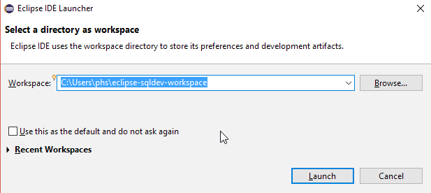

## 2. Clone this repository

Open the Git perspective in Eclipse.


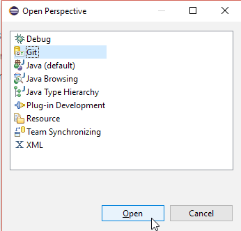

Click on `Clone a Git repository`.


Enter `https://github.com/PhilippSalvisberg/sqldev.git` in the URI field and press `Next`.

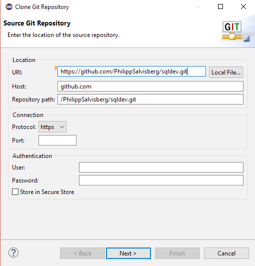

Accept the default branch and press `Next`.

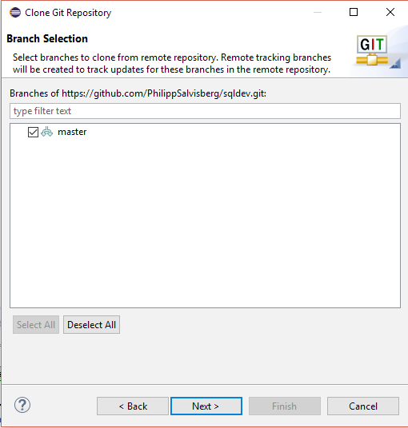

Change directory to `c:\git\sqldev` and press `Finish`.

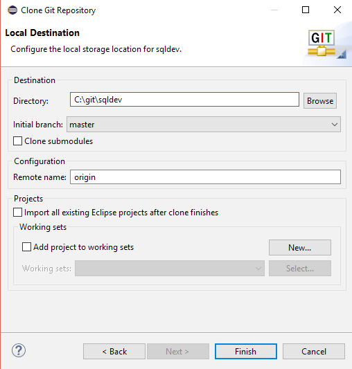

## 3. Open example `050_bundled`

Switch to the Java perspective and press `Import projects...`.

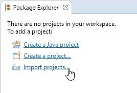

Select `Existing Maven Projects` and press `Next`.

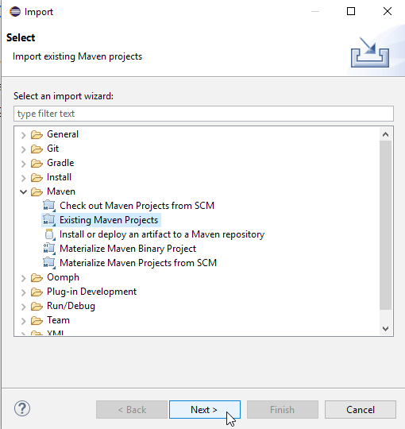

Select the root directory `C:\git\sqldev\examples\050_bundled` and press `Finish`.

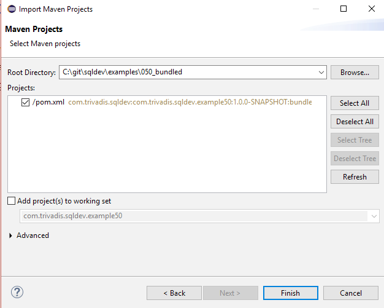

After some seconds you should find the following files in your Project Explorer:

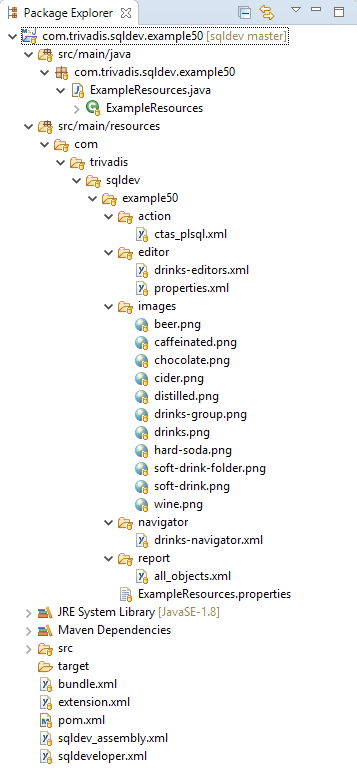

## 4. Build the project

Right click on the project, select `Run As` and click on `Maven build...`.

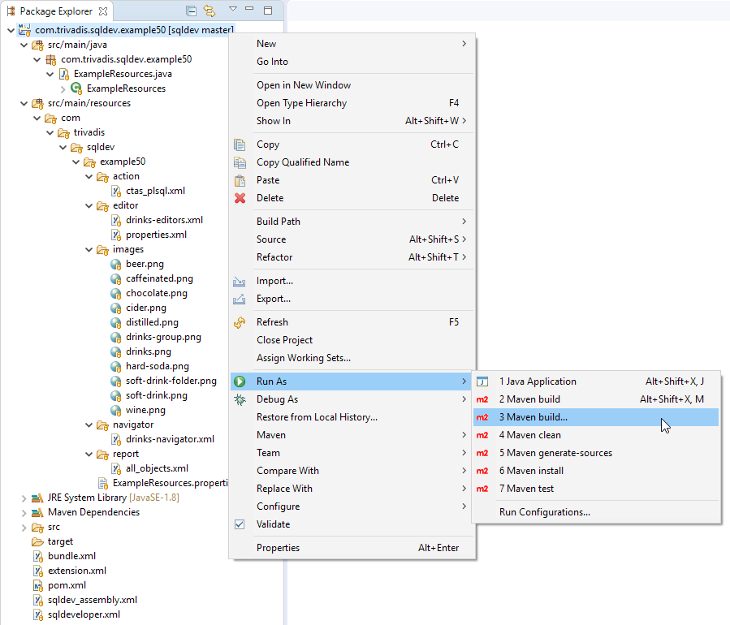

Enter `clean package` in the `Goals` field and press `Run`.

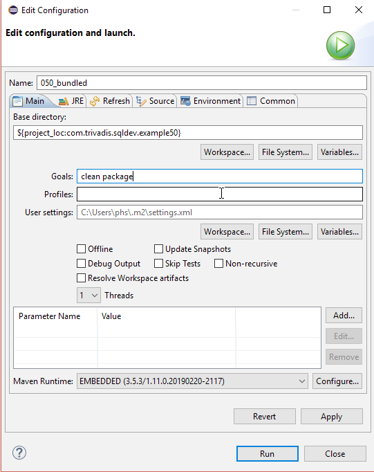.

The console output should look similar to the following:

```text
[INFO] Scanning for projects...
[INFO] 
[INFO] ---------< com.trivadis.sqldev:com.trivadis.sqldev.example50 >----------
[INFO] Building com.trivadis.sqldev.example50 1.0.0-SNAPSHOT
[INFO] -------------------------------[ bundle ]-------------------------------
...
[INFO] Reading assembly descriptor: sqldev_assembly.xml
[INFO] Building zip: C:\git\sqldev\examples\050_bundled\target\Example50_for_SQLDev_1.0.0-SNAPSHOT.zip
[INFO] ------------------------------------------------------------------------
[INFO] BUILD SUCCESS
[INFO] ------------------------------------------------------------------------
[INFO] Total time: 16.159 s
[INFO] Finished at: 2019-04-24T15:47:39+02:00
[INFO] ------------------------------------------------------------------------
```

## 5. Start SQL Developer

Start SQL Developer.

## 6. Remove XML Extensions

Select `Tools`->`Preferences` from the main menu.

In the preferences dialog click on `User Defined Extensions` under the `Database` node.

Remove any installed XML extension.

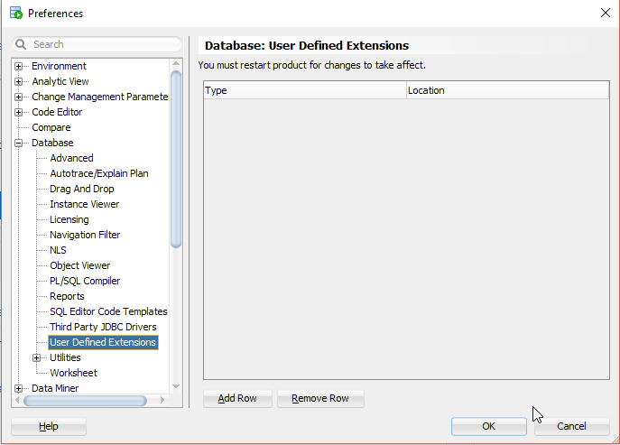

## 7. Install Extension

Select `Help`->`Check for Updates...` from the main menu.

Click on `Install From Local File(s)`, enter `C:\git\sqldev\examples\050_bundled\target\Example50_for_SQLDev_1.0.0-SNAPSHOT.zip` in `File Name(s)` and press `Next`.

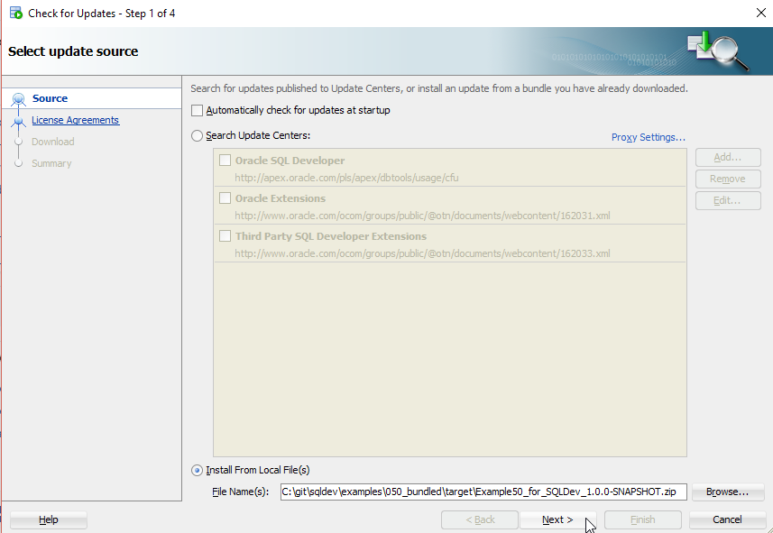

Press `Finish`.

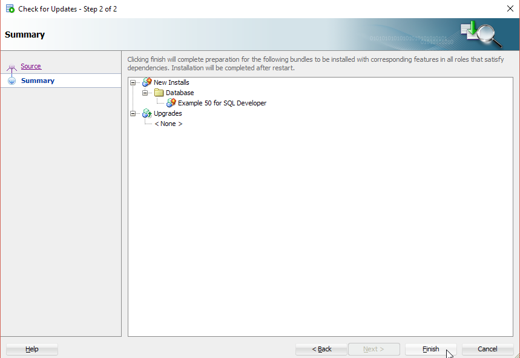

And Press `Yes` to restart SQL Developer.

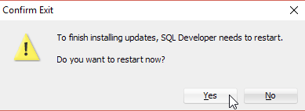

## 8. Run

### 8.1 Report `All Objects`

You find the `All Objects` report in the Report window node.

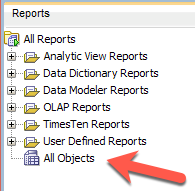

Please note, that the `All Objects` report is placed in the root folder. Add `folder` node(s) in all_objects.xml to place reports in any folder you like.

Click on `All Objects` to run the report.

## 8.2 Editor `Properties`

Open a connection, click on the `Tables` node, click on a table and then on the `Properties` tab.

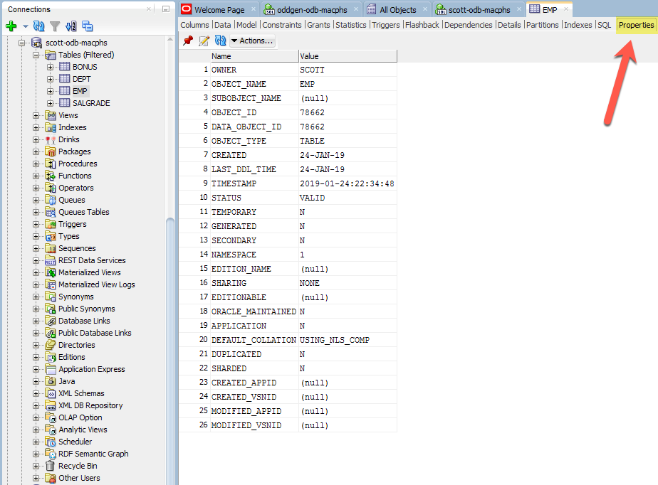

## 8.3 Navigator and Editors for `Drinks`

Open a connection, click on the `Drinks` node, expand all nodes and click on the `Soft drinks` node.

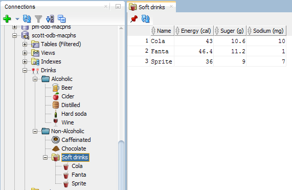

Please note that the icons are different to the user defined extension. For that the follwing files have been added:

- [`Icons`](https://github.com/PhilippSalvisberg/sqldev/tree/master/examples/050_bundled/src/main/resources/com/trivadis/sqldev/example50/images)
- [`ExampleResource.properties`](https://github.com/PhilippSalvisberg/sqldev/blob/master/examples/050_bundled/src/main/resources/com/trivadis/sqldev/example50/ExampleResources.properties)
- [`ExampleResources.java`](https://github.com/PhilippSalvisberg/sqldev/blob/master/examples/050_bundled/src/main/java/com/trivadis/sqldev/example50/ExampleResources.java)

In line 1 of [`drinks-navigator.xml`](https://github.com/PhilippSalvisberg/sqldev/blob/6f87006d20d9260b6ea786b4b85878d84a540e6a/examples/050_bundled/src/main/resources/com/trivadis/sqldev/example50/navigator/drinks-navigator.xml#L1) the `RESOURCE_FILE` references the Java class to load resources.

And the resources are referenced for example in line 4 and 5 of [`drinks-navigator.xml`](https://github.com/PhilippSalvisberg/sqldev/blob/6f87006d20d9260b6ea786b4b85878d84a540e6a/examples/050_bundled/src/main/resources/com/trivadis/sqldev/example50/navigator/drinks-navigator.xml#L4-L5).

Click on the `Cola` node.

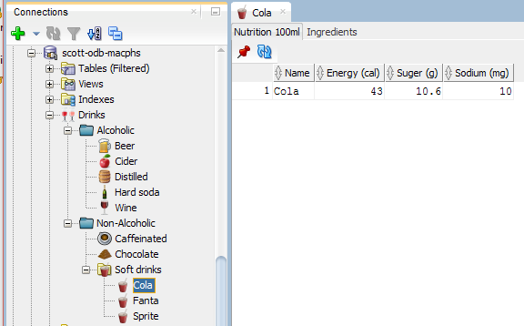

Click on the `Ingredients` tab.

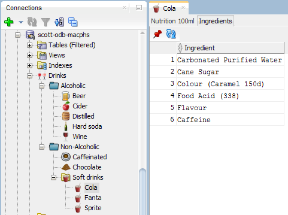

## 8.4 Context Menu `Create Table As Select``

Open a connection, click on Tables, right-click on a table an select `Create Table as Select...`.


Enter a `New table name`, select `75` percent and press the `Apply button`.


# 9. Important Artefacts

Have a look at the following files to understand how the extension is build:

- [`bundle.xml`](https://github.com/PhilippSalvisberg/sqldev/blob/master/examples/050_bundled/bundle.xml) - the placeholders `#EXTENSION_NAME#`, `#EXTENSION_VERSION#`, `#EXTENSION_OWNER#`, `#EXTENSION_DESCRIPTION#` and `#MIN_SQLDEV_VERSION#` are replaced during build. The properties are defined in 
  - [`ExampleResource.properties`](https://github.com/PhilippSalvisberg/sqldev/blob/master/examples/050_bundled/src/main/resources/com/trivadis/sqldev/example50/ExampleResources.properties#L4-L7)
  - [`pom.xml`](https://github.com/PhilippSalvisberg/sqldev/blob/master/examples/050_bundled/pom.xml#L159)

- [`extension.xml`](https://github.com/PhilippSalvisberg/sqldev/blob/master/examples/050_bundled/extension.xml) - all XML extensions are registered here. Placeholders are replaced as in `bundle.xml`.

- [`pom.xml`](https://github.com/PhilippSalvisberg/sqldev/blob/master/examples/050_bundled/pom.xml) - Maven file containing all steps to produce the installable extension (ZIP file).

- [`sqldev_assembly.xml`](https://github.com/PhilippSalvisberg/sqldev/blob/master/examples/050_bundled/sqldev_assembly.xml) - The `maven-assembly-plugin` uses this configuration file in the [`pom.xml`](https://github.com/PhilippSalvisberg/sqldev/blob/master/examples/050_bundled/pom.xml#L227) to build the ZIP file.

- [`sqldeveloper.xml`](https://github.com/PhilippSalvisberg/sqldev/blob/master/examples/050_bundled/sqldeveloper.xml) - Optional update site as an alternative to the ZIP file. Placeholders are replaced as in `bundle.xml`. The path to the extension ZIP File needs to be adjusted.
